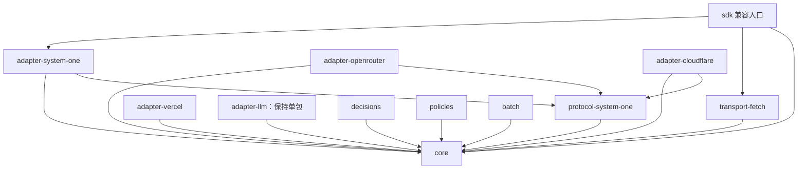

# SDK 包边界与迁移

以 `bc49b67` 的行为为基线，仓库已从单包迁移为 npm workspaces。实现只保留一份，根目录 `src/` 是兼容转导出和默认配置；新代码位于 `packages/`。独立包尚未发布到 npm，当前先通过 workspace 和 tarball 验证。

参考 [AI SDK 的 Providers and Models](https://ai-sdk.dev/docs/foundations/providers-and-models) 和 [Testing](https://ai-sdk.dev/docs/ai-sdk-core/testing)：共享稳定契约、显式传入实现、按供应商独立发布，用确定性测试验证业务行为。沿用已有 `SystemOneAdapter.prepare/decode/authenticate` 契约，不引入另一套 LLM model 层。

## 已落地的包边界

| 包 | 职责 | 运行时依赖 |
| --- | --- | --- |
| `@system-one-ai/core` | 类型、问题构造、请求快照、结果校验、评估生命周期；导出 adapter/transport 契约 | 无 |
| `@system-one-ai/transport-fetch` | Fetch、鉴权、超时、取消、Retry-After、重试、响应读取上限 | core |
| `@system-one-ai/protocol-system-one` | 三个服务共用的 `boolean/noul`、token 和 rounding 编解码 | core |
| `@system-one-ai/adapter-system-one` | TypeSafe 地址、默认模型和原生请求 | core、protocol-system-one |
| `@system-one-ai/adapter-openrouter` | Decisions 地址、options、generation/cost 元数据 | core、protocol-system-one |
| `@system-one-ai/adapter-cloudflare` | 账户路径、REST/runner envelope 校验 | core、protocol-system-one |
| `@system-one-ai/adapter-vercel` | Evaluation v4 请求和响应 | core |
| `@system-one-ai/adapter-llm` | 现有 LLM 协议、prompt、schema、答案转换 | core |
| `@system-one-ai/decisions` | 动作、候选项及参数组合 | core |
| `@system-one-ai/policies` | 概率、差值、confidence gate | core |
| `@system-one-ai/batch` | 并发、取消和部分失败 | core |



core 不导入任何具体 adapter、transport 或供应商 SDK。adapter 之间不互相导入，也不发网络请求。`protocol-system-one` 只共享已经被三个服务使用的 wire codec，没有 endpoint、默认模型、认证或请求生命周期。

core 仍保留当前 HTTP codec 契约中的 URL、headers 和配置类型，以及独立的 `core/http` 校验工具。它不调用 Fetch，不解析供应商特有字段。此次先明确代码所有权与执行边界，保持现有请求语义；如将来需要非 HTTP 执行，再根据具体调用场景调整契约。

## 调用方式

```ts
import { createSystemOne, choice } from '@system-one-ai/core';
import { createFetchTransport } from '@system-one-ai/transport-fetch';
import { openRouterAdapter } from '@system-one-ai/adapter-openrouter';

const client = createSystemOne({
  adapter: openRouterAdapter,
  transport: createFetchTransport(),
  apiKey: process.env.OPENROUTER_API_KEY!,
});
const result = await client.evaluate({
  state: 'The user asked for water.',
  questions: { action: choice('Next action?', { drink: null, rest: null }) },
});
```

`Transport.send` 接收已序列化的请求与调用预算，返回未知 payload 和 HTTP 元数据。Fetch transport 独占鉴权、网络重试和响应读取。core 调用 adapter 解码，再进行领域结果校验；解码或校验失败不会触发网络重试。总时间预算覆盖准备请求、网络、重试和解码。

`core/validation`、`core/http`、`core/composition` 是包间共用的显式工具入口。禁止通过跨目录相对路径读取其他包的私有源文件。错误类型来自同一 core，保持 `instanceof` 行为。

## LLM 保持单包

LLM 是可选、低优先级的兼容能力。OpenAI Responses、OpenAI-compatible Chat Completions、Anthropic Messages、prompt、schema、鉴权映射和概率处理全部保留在 `adapter-llm`。不拆 provider 包，不扩展为通用 LLM 框架。

```ts
import { llmAdapter } from '@system-one-ai/adapter-llm';

const client = createSystemOne({
  adapter: llmAdapter({ provider: 'openai', api: 'chat_completions' }),
  transport: createFetchTransport(),
  baseURL, apiKey, model,
});
```

## 兼容与安装

- `@system-one-ai/sdk` 继续提供默认 TypeSafe adapter 与 Fetch transport。它只依赖 core、transport-fetch、adapter-system-one，不再携带其他 adapter 的实现。
- 旧 `sdk/adapters/*`、`sdk/decisions`、`sdk/policies`、`sdk/batch` 是弃用的转导出；使用时必须显式安装对应包。这些包声明为可选 peer，不会随 SDK 自动安装。
- LLM 从 SDK 根入口移除。改为从 `@system-one-ai/adapter-llm` 导入；避免一次根入口 import 强制加载可选包。
- 下一次发布需要更新 SDK 版本并说明安装方式变化。当前不创建 tag、不发布任何包。

## 构建与验证

```sh
npm ci --ignore-scripts
npm run check
npm run test:package
npm run build --workspace @system-one-ai/adapter-openrouter
npm run typecheck --workspace @system-one-ai/core
npm test --workspace @system-one-ai/adapter-llm
npm run test:live:llm -- /path/to/llm.env
```

每个包都有独立 build、typecheck、test 和 prepack；构建顺序从 package.json 的依赖推导。包测试在仓库之外创建临时项目，只安装目标包及其声明的依赖，验证 ESM/CJS 运行与 NodeNext 声明解析。SDK 的最小安装另行检查可选 adapter 和组合包确实不存在。

原有协议、验证、超时、取消、重试、本地 HTTP、业务场景测试继续通过兼容入口执行，入口直接使用独立包实现。依赖检查拒绝 core 依赖实现包、adapter 互相依赖、未声明依赖和跨包源文件导入。真实 LLM 测试单独执行，读取指定文件，不进入普通 CI，不保存密钥。

## 后续开发规则

1. 协议改动只在所属 adapter 包修改；新增 adapter 不修改 core 或 SDK 根入口。
2. 每次变更先明确契约、涉及的包和可复现验收，再修改代码。包移动、行为变化与发布分开提交。
3. 各包独立版本；破坏共享契约时同时调整相关包的依赖范围，不能只升 core major。
4. 发布按依赖顺序执行，先 core、共享协议/transport，再 adapter/组合包，最后兼容 SDK。现有 SDK 发布脚本会检查依赖的已发布版本与测试产物。
5. registry、middleware、Clock、IdGenerator 等暂不增加。确有多个调用场景需要时再设计，不为 AI SDK 的每一个模块建立对应包。
