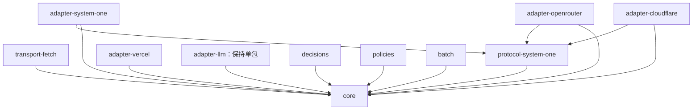

# SDK 包边界与迁移

仓库使用 npm workspaces，运行时代码全部位于 `packages/`。根目录仅负责编排开发、测试和发布，标记为 private；旧 SDK 入口、转导出和默认客户端已删除。11 个独立包已发布稳定版 `0.6.0`，通过 npm 默认 `latest` 安装，详见[迁移说明](migration-0.6.md)与[验证记录](validation.md)。

参考 [AI SDK 的 Providers and Models](https://ai-sdk.dev/docs/foundations/providers-and-models) 和 [Testing](https://ai-sdk.dev/docs/ai-sdk-core/testing)：共享稳定契约、显式传入实现、按供应商独立发布，用确定性测试验证业务行为。沿用已有 `SystemOneAdapter.prepare/decode/authenticate` 契约，不引入另一套 LLM model 层。

## 已落地的包边界

| 包 | 功能 | 运行时依赖 |
| --- | --- | --- |
| `@system-one-ai/core` | 创建统一的 `evaluate` 客户端，定义选择、评分和真假问题，并校验模型返回的答案。 | 无 |
| `@system-one-ai/transport-fetch` | 通过 Fetch 发送模型请求，处理鉴权、超时、取消、重试和响应大小限制。 | core |
| `@system-one-ai/protocol-system-one` | 在本库的问题／答案格式与原生 System One 协议之间转换，供 TypeSafe、OpenRouter 和 Cloudflare adapter 复用。 | core |
| `@system-one-ai/adapter-system-one` | 连接 TypeSafe 官方 System One 服务，用原生决策模型回答选择、评分和真假问题。 | core、protocol-system-one |
| `@system-one-ai/adapter-openrouter` | 通过 OpenRouter Decisions 接口调用 System One 模型，将答案、用量和费用信息转换为本库结果。 | core、protocol-system-one |
| `@system-one-ai/adapter-cloudflare` | 在 Cloudflare 上调用 System One 模型，支持 REST API 和 Workers 内的 `env.AI` binding。 | core、protocol-system-one、transport-fetch |
| `@system-one-ai/adapter-vercel` | 通过 Vercel AI Gateway 的 Evaluation 接口调用决策模型，将请求和答案转换为本库格式。 | core |
| `@system-one-ai/adapter-llm` | 把通用 LLM 接口适配为 System One 决策接口：将问题转为 prompt 和输出约束，再把 LLM 回答转换为选择、评分和真假结果。 | core |
| `@system-one-ai/decisions` | 让模型从业务对象中选出目标、选择动作及其参数，并将答案映射回原始对象，供应用执行。 | core |
| `@system-one-ai/policies` | 按概率、选项差值或 confidence 阈值判断是否接受模型答案，明确返回接受、不确定或弃权。 | core |
| `@system-one-ai/batch` | 以指定并发数执行多次 `evaluate`，按输入顺序返回每项结果，保留失败和取消信息。 | core |



core 不导入任何具体 adapter、transport 或供应商 SDK。adapter 之间不互相导入。REST adapter 只做编解码；Cloudflare 的独立 workers 入口实现 EvaluationClient，复用 transport-fetch 的响应和期限工具，调用原生 binding。`protocol-system-one` 只共享已经被三个服务使用的 wire codec，没有 endpoint、默认模型、认证或请求生命周期。

core 仍保留当前 HTTP codec 契约中的 URL、headers 和配置类型，以及独立的 `core/http` 校验工具。它不调用 Fetch，不解析供应商特有字段。此次先明确代码所有权与执行边界，保持现有请求语义；如将来需要非 HTTP 执行，再根据具体调用场景调整契约。

## 调用方式

```ts
import { createSystemOne, choice } from '@system-one-ai/core';
import { createFetchTransport } from '@system-one-ai/transport-fetch';
import { openRouterAdapter } from '@system-one-ai/adapter-openrouter';

const client = createSystemOne({
  adapter: openRouterAdapter,
  transport: createFetchTransport(),
  apiKey: process.env.OPENROUTER_API_KEY!,
});
const result = await client.evaluate({
  state: 'The user asked for water.',
  questions: { action: choice('Next action?', { drink: null, rest: null }) },
});
```

`Transport.send` 接收已序列化的请求与调用预算，返回未知 payload 和 HTTP 元数据。Fetch transport 独占鉴权、网络重试和响应读取。core 调用 adapter 解码，再进行领域结果校验；解码或校验失败不会触发网络重试。总时间预算覆盖准备请求、网络、重试和解码。

`core/validation`、`core/http`、`core/composition` 是包间共用的显式工具入口。禁止通过跨目录相对路径读取其他包的私有源文件。错误类型来自同一 core，保持 `instanceof` 行为。

## LLM 到 System One 的适配

`adapter-llm` 让通用 LLM 提供 System One 决策能力：接收统一的状态和选择／评分／真假问题，生成 LLM prompt 与 JSON 输出约束，再将 LLM 回答转换成 core 可以校验的答案。应用使用同一个 `evaluate` 接口，也可以继续使用 decisions、policies 和 batch。

OpenAI Responses、OpenAI-compatible Chat Completions 和 Anthropic Messages 的协议转换都由这个可选包完成，LLM 支持保持单包。概率模式中的数值来自 LLM 自报；离散模式将选定答案编码为 0/1，不能将这种编码当成模型实测置信度。

```ts
import { llmAdapter } from '@system-one-ai/adapter-llm';

const client = createSystemOne({
  adapter: llmAdapter({ provider: 'openai', api: 'chat_completions' }),
  transport: createFetchTransport(),
  baseURL, apiKey, model,
});
```

## 安装与迁移

应用显式安装 core、transport-fetch 和所选 adapter，组合功能按需安装。旧 `@system-one-ai/sdk` 包及其子路径不再由本仓库构建或发布。迁移时将 import 改为上表的独立包名，构造客户端必须传入 `adapter` 和 `transport`；自定义 fetch 改为 `createFetchTransport(fetch)`。没有默认供应商或隐式网络实现。

验证候选包时，运行构建和打包检查后，从 `.artifacts/` 安装所选包及其依赖的 tarball；正式发布按 [Release PR 流程](releasing.md)执行。

## 构建与验证

```sh
npm ci --ignore-scripts
npm run check
npm run test:package
npm run build --workspace @system-one-ai/adapter-openrouter
npm run typecheck --workspace @system-one-ai/core
npm test --workspace @system-one-ai/adapter-llm
npm run test:live:llm -- /path/to/llm.env
```

每个包都有独立 build、typecheck、test 和 prepack；构建顺序从 package.json 的依赖推导。包测试在仓库之外创建临时项目，只安装目标包及其声明的依赖，验证 ESM/CJS 运行与 NodeNext 声明解析。所有类型推导和负面断言还会对已安装的 ESM/CJS 声明再次执行。

协议、验证、超时、取消、重试、本地 HTTP、业务场景测试直接导入独立包。依赖检查拒绝 core 依赖实现包、adapter 互相依赖、未声明依赖和跨包源文件导入。真实 LLM 测试单独执行，读取指定文件，不进入普通 CI，不保存密钥。

## 后续开发规则

1. 协议改动只在所属 adapter 包修改；新增 adapter 不修改 core。
2. 每次变更先明确契约、涉及的包和可复现验收，再修改代码。包移动、行为变化与发布分开提交。
3. 各包独立版本；破坏共享契约时同时调整相关包的依赖范围，不能只升 core major。
4. Changesets Release PR 确定发布批次，工作流按依赖顺序发布固定产物并验收，再晋级标签、生成 `<包目录>-v<版本>` tag；包 tag 不触发发布。详见[发布说明](releasing.md)。
5. registry、middleware、Clock、IdGenerator 等暂不增加。确有多个调用场景需要时再设计，不为 AI SDK 的每一个模块建立对应包。
