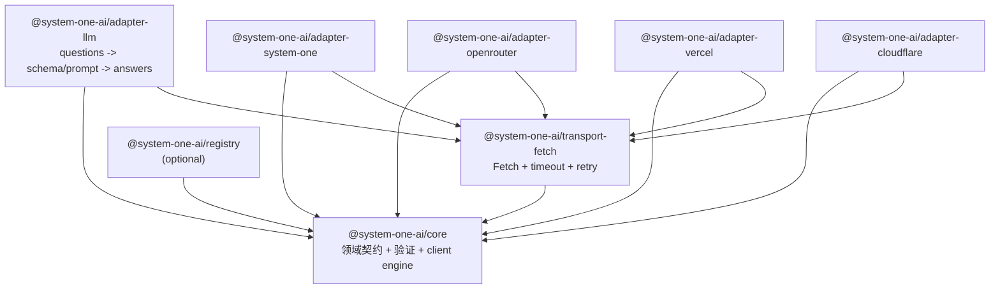

# SDK 解耦重构计划

这份计划以当前提交 `bc49b67` 为基线。目标是让核心库只负责统一的决策契约和生命周期，把 HTTP 和协议 adapter 移到独立包；LLM 保留为一个可选的单体 adapter 包。

设计参考：

- [AI SDK Providers and Models](https://ai-sdk.dev/docs/foundations/providers-and-models)：用稳定的 model/adapter contract 隔离业务和协议。
- [AI SDK Provider & Model Management](https://ai-sdk.dev/docs/ai-sdk-core/provider-management)：把可选的 model registry 放在核心之外。
- [AI SDK Language Model Middleware](https://ai-sdk.dev/docs/ai-sdk-core/middleware)：日志、缓存和重试通过 wrapper 组合，而不是写进业务流程。
- [AI SDK Testing](https://ai-sdk.dev/docs/ai-sdk-core/testing)：用 mock model 和固定 fixture 测试，不让业务测试依赖真实 API。

## 当前问题

当前 `@system-one-ai/sdk` 同时包含：

- 决策领域类型、问题构造器和答案验证；
- Fetch、鉴权、取消、超时、重试和响应读取；
- TypeSafe、OpenRouter、Vercel、Cloudflare 和 LLM 的协议细节；
- decisions、policies、batch 等上层组合模块。

`src/adapters/llm.ts` 同时处理 prompt、JSON schema、OpenAI/Anthropic wire format、鉴权和答案转换；这部分保留在 LLM 包内，不再把它拆成多个 provider 包。真正需要解决的是根包同时携带所有 adapter，导致任一协议变化都会扩大核心 diff 和测试矩阵。

## 目标包图



依赖方向只允许从上到下：核心不导入任何 adapter；adapter 互不导入；transport 只处理 HTTP 生命周期；registry 只负责选择已构造的 adapter 和别名。

## 目标契约

### `@system-one-ai/core`

核心只保留：

- `Question`、`Answer`、`EvaluateRequest`、`EvaluationResult`；
- 输入快照、领域验证和结果验证；
- `EvaluationClient` 与一次评估的生命周期；
- `SystemOneAdapter`、`EvaluationClient` 等稳定契约；
- 可注入的 `Transport`、`Clock` 和 `IdGenerator` 接口。

核心不认识：URL、Bearer、`x-api-key`、OpenAI、Anthropic、Cloudflare、`providerOptions` 的具体字段和任何 provider SDK。

`SystemOneAdapter` 继续只负责 `prepare`、`decode` 和协议认证；核心负责请求快照、Fetch 生命周期、重试和最终答案验证。这样现有 adapter contract 可以直接迁移，不需要先引入一层只有一个实现的 model 抽象。

### `@system-one-ai/transport-fetch`

这个包实现通用 HTTP 生命周期：

- Fetch、AbortSignal、总 deadline、响应大小限制；
- HTTP 状态、Retry-After、网络错误和重试策略；
- 鉴权头合并及跨 origin 保护；
- 不记录 key、请求体和上游错误正文。

它只接受已经准备好的 `HttpRequest`，不知道请求体里是 `questions`、`input` 还是 `messages`。adapter 可换成自带 SDK 或测试 transport，而不修改核心。

### `@system-one-ai/adapter-*`

每个协议一个包，每个包只做一件事：把标准 `EvaluateRequest` 编码成该服务的请求，再把响应映射回标准结果。

第一批包：

| 包 | 负责 | 依赖 |
| --- | --- | --- |
| `@system-one-ai/adapter-system-one` | TypeSafe System One 原生协议 | `core`, `transport-fetch` |
| `@system-one-ai/adapter-openrouter` | Decisions 协议和 generation metadata | `core`, `transport-fetch` |
| `@system-one-ai/adapter-vercel` | Evaluation v4 | `core`, `transport-fetch` |
| `@system-one-ai/adapter-cloudflare` | 账户路径、AI runner envelope | `core`, `transport-fetch` |
| `@system-one-ai/adapter-llm` | LLM 输出 schema、prompt、答案转换和 LLM 协议 | `core`, `transport-fetch` |

这些包不能互相导入。Cloudflare 的账户校验只存在 Cloudflare 包；OpenRouter 的 provider options 只存在 OpenRouter 包；LLM 的概率归一化、prompt、schema 和 OpenAI/Anthropic 协议细节全部只存在 LLM 包。

### `@system-one-ai/adapter-llm`

LLM 是低优先级、可选的兼容 adapter，不进入 core，也不拆出独立 provider 包。它内部继续支持当前的 OpenAI Responses、OpenAI-compatible Chat Completions 和 Anthropic Messages；新增 LLM 协议只修改这个包。

```ts
import { createSystemOne } from '@system-one-ai/core';
import { createLlmAdapter } from '@system-one-ai/adapter-llm';

const client = createSystemOne({
  baseURL,
  apiKey,
  model: 'deepseek-flash',
  adapter: createLlmAdapter({ provider: 'openai' }),
});
```

### `@system-one-ai/registry`

借鉴 AI SDK 的 registry，用稳定 ID 选择已经构造好的 adapter，并允许应用定义别名和白名单：

```ts
const adapters = createAdapterRegistry({
  native: systemOneAdapter,
  llm: createLlmAdapter(),
});

const adapter = adapters.get('llm');
```

registry 是可选的。核心永远接收已解析的 adapter，避免在运行时猜协议或根据 hostname 改行为。

## 组合与 middleware

`decisions`、`policies` 和 `batch` 移到独立包：

- `@system-one-ai/decisions`：动作和参数组合；
- `@system-one-ai/policies`：概率、差值、confidence gate；
- `@system-one-ai/batch`：并发、取消和部分失败。

它们只依赖 `EvaluationClient`/领域类型，不依赖任何 adapter。

日志、缓存、fallback、限流、telemetry 和 prompt guardrail 使用 adapter/client wrapper：

```ts
const client = wrapEvaluationClient({
  client,
  middleware: [withTelemetry(), withRetry(), withCache()],
});
```

wrapper 只接收标准 request/result；不得解析具体协议 response body。这样缓存和 telemetry 可以跨原生 adapter 和 LLM adapter 复用。

## 迁移顺序

1. **冻结当前契约**：保留 `bc49b67`，把 `types.ts` 中领域类型与 transport/adapter 类型拆成独立文件；不改变行为。
2. **先抽接口**：冻结现有 `SystemOneAdapter`、`Transport`、`ProviderResponse` contract，让现有 adapter 通过 bridge 实现；现有测试继续跑。
3. **抽出 transport**：把 `transport.ts` 移到 `transport-fetch`，核心只依赖接口；错误类型按 `core`、`transport`、`adapter` 分层。
4. **拆原生 adapter**：先移动 `system-one`，再移动 OpenRouter、Vercel、Cloudflare；每个包带自己的 contract fixture、声明测试和 live script。
5. **移动 LLM**：将当前 `llm.ts` 整体移动到 `adapter-llm`，保留现有 OpenAI、OpenAI-compatible 和 Anthropic 支持；不拆 provider，不让 LLM 阻塞原生 adapter 拆分。
6. **移出组合模块**：decisions、policies、batch 改为 workspace 子包，核心只保留 `EvaluationClient`。
7. **兼容发布**：当前包进入兼容期，只保留核心与明确安装的 adapter 入口；旧 `@system-one-ai/sdk/adapters/*` 入口发出 deprecation，下一主版本移除。

每一步都保持可发布状态。不要一次性改名、改协议和改包结构；每次迁移只移动一个边界，并保留一个 bridge。

## 发布与测试规则

- 使用 npm workspaces，所有包共享 TypeScript 基础配置，但每个包独立 `build`、`typecheck`、`test` 和 `pack`。
- 核心 CI 不安装任何 adapter，也不读取环境变量。
- adapter test 用固定 JSON fixture；LLM live test 只在 `adapter-llm` 包执行。
- 每个 adapter 包声明自己的可选依赖，安装核心不会带来 OpenAI、Anthropic 或 Playwright。
- 包版本独立；领域契约破坏只升级 `core` major，单个 adapter 可以独立 minor/patch。
- 发布前检查依赖图，禁止 `core -> adapter-*`、`adapter-a -> adapter-b` 和 adapter 反向依赖业务组合包。

## 暂不做的事

- 不在核心里加入 adapter 自动发现、hostname 猜测或全局 registry。
- 不把所有 adapter options 提升为一套“万能配置”；未识别字段留在对应 adapter 包。
- 不为了兼容一次性保留全部旧内部模块；兼容只保留公开入口和一个过渡 bridge。
- 不先做 streaming、tool calling、embedding 等与当前决策 API 无关的能力；先把一次结构化评估的边界拆干净。
